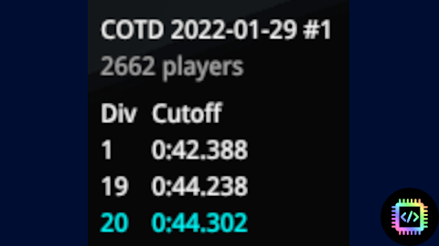

# [COTD Stats](https://openplanet.dev/plugin/cotdstats)

## Shows your division stats as you play COTD qualifying

---

Displays a widget that shows your current division as you play COTD qualifying.

## Features
- Shows total number of players
- Shows div 1 cutoff time
- Shows your "next best" div cutoff time

## Change log

### v1.3
- refactor code to use `Permissions.as` and `Time::ParseRelativeTime()`

### v1.2.1
- fixed condition when map is not set yet

### v1.2
- all intended features realized 

### v1.0
- Initial release

